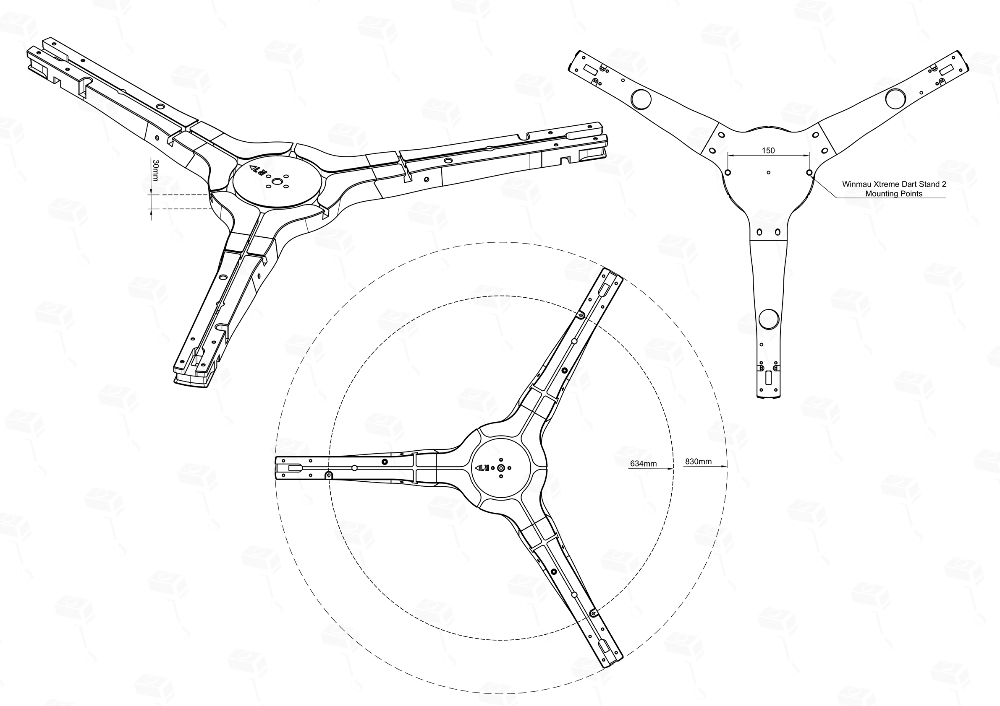
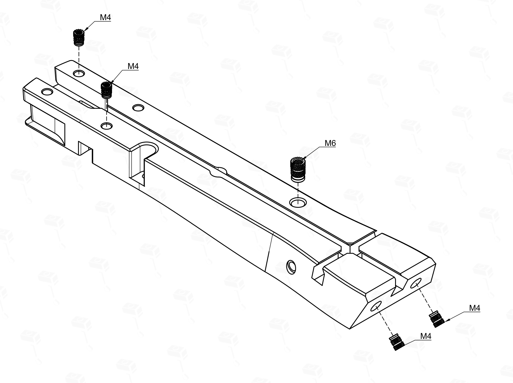
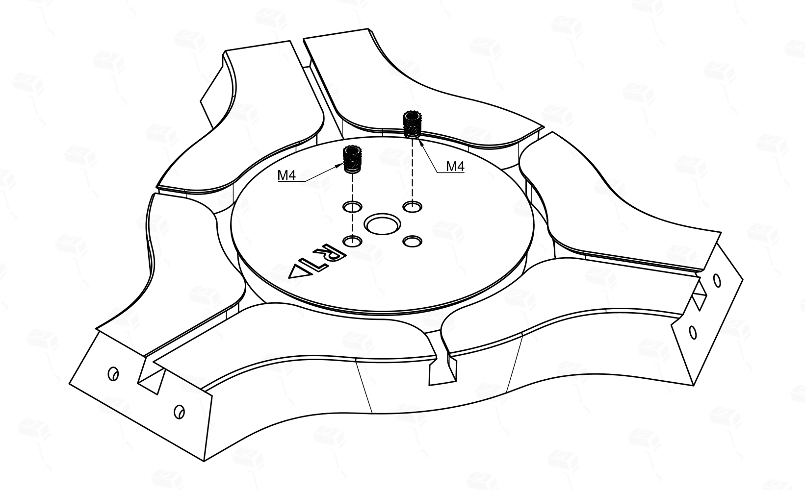
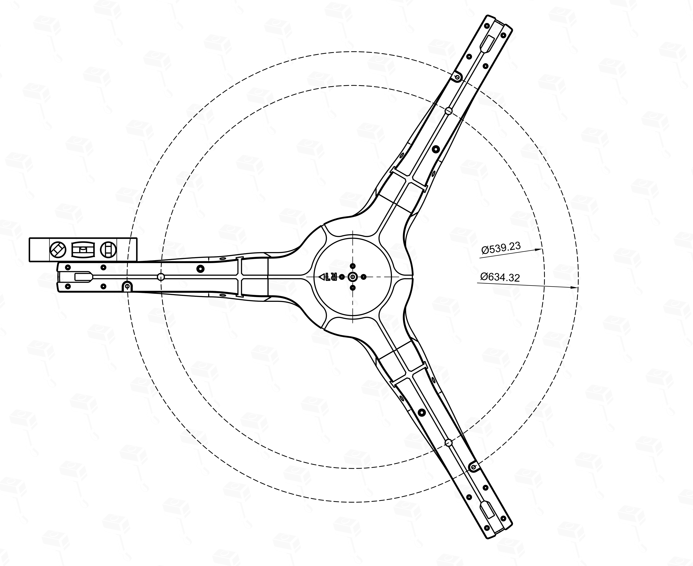

# IT2 Baseplate - Montage- & Installatiehandleiding

> 🛠️ **Hoofdhandleiding:** Op zoek naar de instructies voor het camerasysteem? [Bekijk de IT2 Systeemhandleiding](README.nl.md)
>
> ---
> *Opmerking: Als solo-ontwerper die dit hele project beheert, gebruik ik AI-assistentie om te helpen met de uitgebreide documentatie. Sommige onderdelen kunnen AI-gegenereerde fouten of misverstanden bevatten. Totdat ik de tijd heb om elke sectie volledig te herzien en te verfijnen, verzoeken wij u attent te blijven en contact op te nemen via Discord als u problemen tegenkomt.*

De **IT2 Baseplate** is een montageoplossing voor het IT2 Autodarts-systeem. Het is ontworpen om de installatie te vereenvoudigen, je muren te beschermen en biedt geavanceerde functies zoals geluidsdemping en native compatibiliteit met dartbordstandaards.

> 📥 **Bestanden downloaden:** [IT2 Baseplate op Makerworld](https://makerworld.com/en/models/2782096)

---
## Inhoudsopgave
1. [Algemeen Overzicht: De IT2 Baseplate](#1-algemeen-overzicht-de-it2-baseplate)
2. [Wat je nodig hebt](#2-wat-je-nodig-hebt)
3. [Algemene Montage: Baseplate Segmenten](#3-algemene-montage-baseplate-segmenten)
    * [3.1 Stap 1: Heat Inserts installeren](#31-stap-1-heat-inserts-installeren)
    * [3.2 Stap 2: De segmenten verbinden](#32-stap-2-de-segmenten-verbinden)
    * [3.3 Stap 3: Het IT2-systeem bevestigen](#33-stap-3-het-it2-systeem-bevestigen)
4. [Laatste Stap: Installatie & Montage](#4-laatste-stap-installatie--montage)
    * [4.1 Montage-instructies: Wandmontage (Optie A)](#41-montage-instructies-wandmontage-optie-a)
    * [4.2 Montage-instructies: Dartbordstandaard (Option B)](#42-montage-instructies-dartbordstandaard-option-b)
5. [Pro Tips: Geavanceerde Functies & Add-ons](#5-pro-tips-geavanceerde-functies--add-ons)
    * [5.1 Geluidsdemping](#51-geluidsdemping)
    * [5.2 RGB Ring Uitbreiding & Camera Shroud](#52-rgb-ring-uitbreiding--camera-shroud)
    * [5.3 Toekomstige Functies (In ontwikkeling)](#53-toekomstige-functies-in-ontwikkeling)

---

## 1. Algemeen Overzicht: De IT2 Baseplate

Hoewel het IT2-systeem direct aan de muur kan worden gemonteerd, biedt de Baseplate verschillende belangrijke voordelen:
*   **Structurele Stijfheid:** Het 4-delige ontwerp biedt superieure stabiliteit in vergelijking met 7-delige alternatieven. Deze verhoogde stijfheid minimaliseert buigen en doorzakken, waardoor je camera-armen in hun exacte positie blijven.
*   **Minimaal Boren:** Er zijn slechts 3 gaten in je muur nodig in plaats von 6+.
*   **Perfecte Uitlijning:** De baseplate zorgt ervoor dat je camera-armen perfect gecentreerd en waterpas staan ten opzichte van de bullseye.
*   **Geluidsdemping:** Geïntegreerde ronde uitsparingen met schroefdraad voor speciale TPU-dempers om geluidsoverdracht te verminderen.
*   **Compatibiliteit met Standaards:** Native compatibiliteit met de **Winmau Xtreme 2** mobiele dartbordstandaard, standaard en zonder aanpassingen.

---

## 2. What je nodig hebt

De Baseplate is ontworpen om dezelfde hardware te gebruiken als de rest van het IT2-systeem om alles eenvoudig te houden.

| Onderdeel | Type | Wand Qty | Stand Qty | Link | Opmerking |
| ------------------ | ------------------------ | -------- | --------- | ---- | --------------------------------------------------- |
| Cilinderschroeven | M4x10mm (ISO4762/DIN912) | 8 | 8 | [Aliexpress](https://s.click.aliexpress.com/e/_c4WUfT79) [Amazon.nl](https://amzn.to/49r8kCE) | Voor montage en IT2-bevestiging. |
| M6 Heat Inserts | M6 (8mm OD) | 3 | 7 | [Aliexpress](https://s.click.aliexpress.com/e/_c3iaYfkD) | **Verplicht** voor Rota Locks. |
| M4 Heat Inserts ⚠️ | 6.3mm OD (max 9mm long) | 8-16 | 8-16 | [Aliexpress](https://s.click.aliexpress.com/e/_c3iaYfkD) [Amazon.nl](https://amzn.to/4wZr2uZ) | 6mm OD past ook. ⚠️ **Alleen voor Heat Insert versie.** |

> 💡 **Wandmontage Tip:** Voor wandinstallatie raden we het gebruik van **3x 4mm houtschroeven** aan met voldoende lengte (typische opstelling: 6mm pluggen met 30-40mm schroeven).

> 🖨️ **3D-printen:** Als je de Makerworld .3mf profielen niet gebruikt, raadpleeg dan de **[Universal Printing Guide](PRINTING.md)** voor aanbevolen instellingen en materialen.

---

## 3. Algemene Montage: Baseplate Segmenten

### 3.1 Stap 1: Heat Inserts installeren

> 💡 **Belangrijk:** Hoewel er een "Self-Tapping" versie van de baseplate beschikbaar is, geldt dit alleen voor de M4-bevestigingspunten. De **M6 heat inserts** voor the Rota Locks are **altijd verplicht** voor alle versies, omdat deze onderdelen vaak worden afgesteld en de duurzaamheid van een metalen schroefdraad nodig hebben.

Als je de **Heat Insert versie** gebruikt, smelt dan de M4 inserts in de daarvoor bestemde gaten aan de uiteinden van de drie montagearmen.

> 💡 **M4 Heat Insert Gids voor Dartbordmontage:**
> Standaard Wandmontage: Gebruik **2 inserts zoals getoond op de foto**.
> Mobiele Standaard of Laag Plafond: Gebruik de **andere twee ongebruikte gaten** (of alle vier) per arm.
> Add-ons: Extra inserts kunnen nodig zijn voor [Add-ons](#5-pro-tips-geavanceerde-functies--add-ons).

> 
> ⚠️ **Oriëntatie:** De foto's tonen de **standaard uitlijning**. Als je bouwt voor een dartstandaard of laag plafond, zorg er dan voor dat je de armen correct oriënteert (met gebruik van de alternatieve montagegaten).

### 3.2 Stap 2: De segmenten verbinden
De drie montagearmen worden verbonden met het middelpunt via een eenvoudige **face-to-face schroeverbinding**.
1. Lijn de montagearmen uit met het middelpunt.
2. Bevestig elke arm mit de meegeleverde schroefpunten.

### 3.3 Stap 3: Het IT2-systeem bevestigen
Het wordt ten zeerste aanbevolen om je gemonteerde IT2-scoreingssysteem aan de baseplate te bevestigen voordat je deze aan de muur of standaard monteert. Je kunt deze stap echter auch achteraf uitvoeren indien gewenst.
1. Plaats je gemonteerde IT2-systeem (de drie camera-armen verbonden met de ring) op de baseplate.
2. Lijn de poten van de camera-armen uit met de bevestigingspunten op de baseplate-armen.
3. Zet het systeem vast met **drie M4-schroeven**.

---

## 4. Laatste Stap: Installatie & Montage

De IT2 Baseplate kan direct aan een muur of op een mobiele dartbordstandaard worden gemonteerd. Kies de sectie hieronder die past bij jouw opstelling.

### 4.1 Montage-instructies: Wandmontage (Optie A)
Het installeren van de IT2 Baseplate aan de muur is eenvoudig en nauwkeurig.

1.  **Bullseye vinden:** Meet en markeer de officiële bullseye-hoogte (**1,73 m**) op je muur.
2.  **Positionering:** Lijn het middelste gat van de baseplate uit met de gemarkeerde bullseye-hoogte. Indien mogelijk kun je het middelpunt alvast met een schroef vastzetten - hierdoor kun je de baseplate vrij draaien voor een perfecte uitlijning.
3.  **Uitlijning:** Gebruik de „LR“-indicatoren op de armen om een van de armen in de richting van het **11-segment** (Links) of het **9-segment** (Rechts) te positioneren.
4.  **Waterpas zetten:** Gebruik tot slot een waterpas op de buitenrand om de baseplate waterpas te stellen.
5.  **Vastzetten:** Schroef de baseplate aan de muur op de plaatsen die in de onderstaande afbeelding worden getoond.

> ⚠️ **Belangrijk:** De baseplate voegt **30mm diepte** toe aan je opstelling. Je **MOET** je oche (werplijn) met 30mm naar achteren verplaatsen om de officiële toernooiafstanden te behouden.

### 4.2 Montage-instructies: Dartbordstandaard (Option B)
Deze methode maakt een volledig mobiele opstelling mogelijk. De IT2 Baseplate heeft een gatenpatroon dat expliciet is ontworpen om zonder aanpassingen op de **Winmau Xtreme Dartboard Stand 2** te passen.

1.  **Uitlijning:** Lijn de montagegaten van de baseplate uit met de beugels van je standaard.
2.  **Vastzetten:** Gebruik de hardware die bij je standaard is geleverd of M6-schroeven om de baseplate vast te zetten.
3.  **Ondersteuning (Optioneel):** Als je opstelling topzwaar aanvoelt, raden we aan de extra ondersteunings-add-ons te gebruiken die in het printprofiel zijn meegeleverd (vereist 2 extra M6 heat inserts).

---

## 5. Pro Tips: Geavanceerde Functies & Add-ons

Het IT2 Baseplate-systeem ondersteunt verschillende modulaire add-ons om de functionaliteit uit te breiden:

### 5.1 Geluidsdemping (Optionele Add-on)
De achterkant van de baseplate-segmenten is voorzien van **ronde uitsparingen met schroefdraad** ontworpen voor 3D-geprinte TPU-dempers. Deze inserts maken het scoreingssysteem niet stiller voor de speler, maar ze voorkomen effectief dat trillingen en geluid via de muur naar andere kamers worden overgedragen.

#### Installatie & Wandmontage met dempers:
Als je ervoor kiest om de TPU-dempers te gebruiken, verandert het proces van wandmontage:

1.  **Baseplate voorbereiden:** Gebruik een schroevendraaier en een hamer (of vergelijkbaar gereedschap) om de voorgeperforeerde gaten in het midden van de baseplate-uitsparingen eruit te slaan.
2.  **Dempers plaatsen:** Schroef de 3D-geprinte TPU-dempers in de uitsparingen met schroefdraad.
3.  **Montage:** Gebruik de gaten in het midden van de TPU-dempers om het geheel aan de muur te bevestigen.

> ⚠️ **Belangrijk:** Draai de schroeven niet te vast aan. Het TPU moet stevig vastzitten, maar mag niet geplet of overmatig samengedrukt worden, omdat dit het dempende effect teniet zou doen.

### 5.2 RGB Ring Uitbreiding & Camera Shroud (In ontwikkeling)
Een aankomende multifunctionele uitbreiding ontworpen voor zowel sfeerverlichting als betrouwbaarheid van de scoreherkenning:
*   **RGB LED Ondersteuning:** Maakt het mogelijk om extra RGB LED-strips rond de buitenkant van de lichtring te monteren voor eigen visuele effecten.
*   **Detectie Shroud:** De uitbreiding fungeert ook als een "shroud" of kraag die het systeem omsluit. Dit voorkomt dat de camera's achtergrondbewegingen zien, wat de detectie van de darts aanzienlijk verbetert.
*   **💡 Aanbeveling:** Deze shroud wordt ten zeerste aanbevolen voor **mobiele standaard-opstellingen**, waar een statische achtergrond niet altijd gegarandeerd kan worden.

### 5.3 Toekomstige Functies (In ontwikkeling)
De volgende functies zijn momenteel in ontwikkeling:
*   **Geïntegreerde Raspberry Pi houder:** Native ondersteuning voor het direct monteren van een Raspberry Pi op de baseplate voor een volledig zelfstandige score-eenheid.
*   **Uitgebreide ondersteuning voor standaards:** We evalueren momenteel de ondersteuning voor extra dartbordstandaards (bijv. KOTO of budgetalternatieven) voor toekomstige updates.

---

[Terug naar de hoofdhandleiding](README.nl.md)
