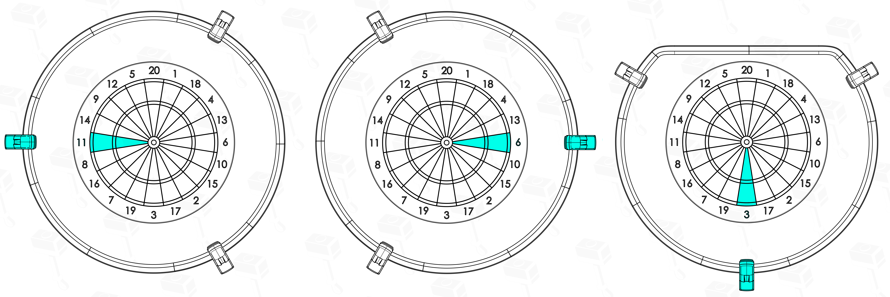
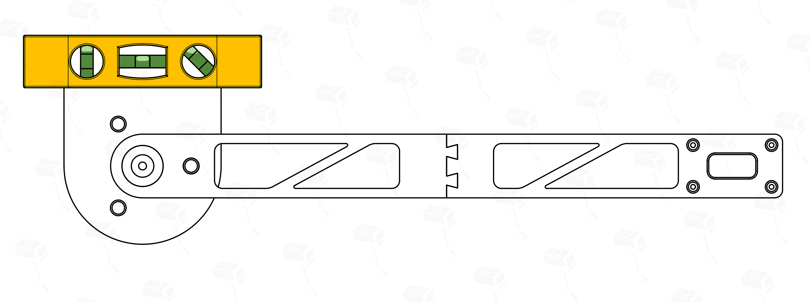
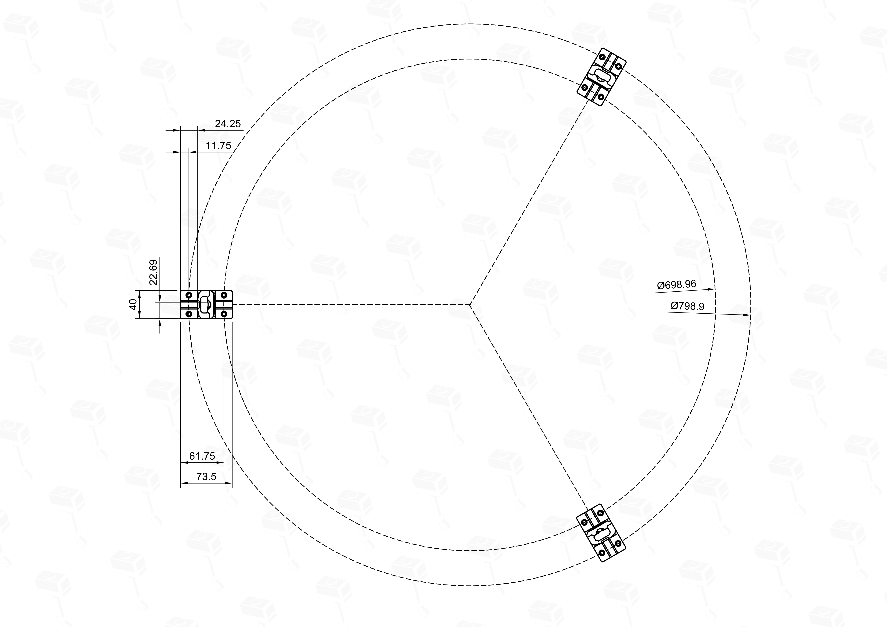

# IT2 - Autodarts Scoring System Handbuch

> 🌍 **Dieses Handbuch ist auch in anderen Sprachen verfügbar:** [English](README.md) | [Nederlands](README.nl.md)  
> 🛠️ **Optionales Upgrade:** Suchst du die Montageplatte? [Hier geht es zum IT2 Baseplate Handbuch](BASEPLATE.de.md)
> ---
> *Hinweis: Da ich dieses Projekt alleine leite, nutze ich KI-Unterstützung für die Fleißarbeit an der Dokumentation – vor allem für die Verlinkungen und den Satzbau. Mein Fokus liegt aktuell darauf, alle technischen Inhalte schnell bereitzustellen, damit ihr mit dem Bauen loslegen könnt. Ein gründliches Proof-Reading und das "Ausbügeln" der Formulierungen mache ich später. Falls euch in der Zwischenzeit etwas unklar vorkommt, sag mir bitte auf Discord Bescheid!*

Willkommen beim offiziellen Handbuch für das IT2 Autodarts Scoring System. Diese Anleitung führt dich durch den gesamten Montageprozess.

> 📥 **Dateien herunterladen:** [IT2 System auf Makerworld](https://makerworld.com/en/models/1334165)

---
## Inhaltsverzeichnis
1. [Allgemeine Übersicht](#1-allgemeine-übersicht)
2. [Was du benötigst](#2-was-du-benötigst)
    * [2.1 Hardware (Erforderlich)](#21-hardware-erforderlich)
    * [2.2 Erforderliches Werkzeug](#22-erforderliches-werkzeug)
3. [Allgemeine Montage: Kamera-Arme](#3-allgemeine-montage-kamera-arme)
    * [3.1 Schritt 1: Kamera-Vorbereitung & Größenanpassung](#31-schritt-1-kamera-vorbereitung--größenanpassung)
    * [3.2 Schritt 2: Vorbereitung der Schmelzeinsätze](#32-schritt-2-vorbereitung-der-schmelzeinsätze)
    * [3.3 Schritt 3: Kamera-Installation & Verschluss](#33-schritt-3-kamera-installation--verschluss)
4. [Aufbau-Optionen: Wähle deinen Weg](#4-aufbau-optionen-wähle-deinen-weg)
    * [4.1 Option 1: Winmau Plasma Lichtring](#41-option-1-winmau-plasma-lichtring)
    * [4.2 Option 2: IT2 DIY Lichtring](#42-option-2-it2-diy-lichtring)
    * [4.3 Option 3: Target Corona Lichtring](#43-option-3-target-corona-lichtring)
    * [4.4 Option 4: IT2 DIY Low Ceiling Lichtring](#44-option-4-it2-diy-low-ceiling-lichtring)
5. [Vor der Installation: Kamera-Positionierung](#5-vor-der-installation-kamera-positionierung)
6. [Letzter Schritt: Installation & Wandmontage](#6-letzter-schritt-installation--wandmontage)
    * [6.1 Montageanleitung: Direkte Wandmontage (Option A)](#61-montageanleitung-direkte-wandmontage-option-a)
    * [6.2 Montageanleitung: Baseplate-Montage (Option B)](#62-montageanleitung-baseplate-montage-option-b)
7. [Profi-Tipps & Fehlerbehebung](#7-profi-tipps--fehlerbehebung)
    * [7.1 Best Practices für die Montage](#71-best-practices-für-die-montage)
    * [7.2 Verstecken des Winmau Plasma Stromkabels](#72-verstecken-des-winmau-plasma-stromkabels)
    * [7.3 Verstecken des Target Corona Stromkabels](#73-verstecken-des-target-corona-stromkabels)
8. [Empfohlene Elektronik](#8-empfohlene-elektronik)
9. [FAQ](#8-faq)
10. [Lizenzierung & Community-Support](#9-lizenzierung--community-support)
11. [Unterstütze das Projekt](#11-unterstütze-das-projekt)

---

## 1. Allgemeine Übersicht

**Projekt Sirius** wurde mit einer klaren Vision entwickelt: der hellste Stern am Himmel zu sein. Es weist den Weg für ein Autodarts-System, das nicht nur mit bestehenden Lösungen gleichzieht, sondern in den Bereichen Ästhetik, Funktionen, Modularität und Benutzerfreundlichkeit deutlich besser sein will.

### Hauptmerkmale
*   **Schlankes Design** - Der bisher schmalste 3D-gedruckte LED-Lichtring (Stand 2026).
*   **Verdeckte Kabelführung** - Interne Kanäle für eine saubere Optik. Passt ohne Modifikationen für Corona- oder Plasma-Stromanschlüsse.
*   **Druck ohne Supports** - Für null Supports optimiert, um Materialabfall und Druckzeit zu minimieren.
*   **Universelle Kompatibilität** - Native Unterstützung für Winmau Plasma, Target Corona und IT2 DIY-Ringe.
*   **Flexible Montage** - Wähle zwischen der **Heat-Insert-Version** oder der **selbstschneidenden Version** (keine Schmelzeinsätze erforderlich).
*   **Minimalistische Hardware** - Gebaut mit nur 12x M4x10mm Schrauben und 6x M2x6mm Schrauben.

---

## 2. Was du benötigst

> **Hinweis:** Viele der unten aufgeführten Produktlinks sind Affiliate-Links. Wenn du über diese Links kaufst, erhalte ich eine kleine Provision ohne zusätzliche Kosten für dich, was die Entwicklung dieses Projekts unterstützt.

> 🖨️ **3D-Druck:** Wenn du nicht die Makerworld .3mf-Profile nutzt, schau dir bitte den **[Universal Printing Guide](PRINTING.md)** für empfohlene Einstellungen und Materialien an.

### 2.1 Hardware (Erforderlich)

| Teil-Name           | Typ                       | Menge | Link                 | Kommentar                                                                                                |
| ------------------- | ------------------------- | ----- | -------------------- | -------------------------------------------------------------------------------------------------------- |
| Zylinderschrauben   | M4x10mm (ISO4762/DIN912)  | 12    | [Aliexpress](https://s.click.aliexpress.com/e/_c4WUfT79) [Amazon.de](https://amzn.to/49r8kCE) | Erforderlich für den Großteil der Montage.                                                               |
| Zylinderschrauben   | M2x6mm (ISO4762/DIN912)   | 6     | [Aliexpress](https://s.click.aliexpress.com/e/_c4WUfT79) [Amazon.de](https://amzn.to/4u4l5du) | Kameraschrauben.                                                                                         |
| M4 Schmelzeinsätze ⚠️ | 6,3mm AD (max 9mm lang)   | 12    | [Aliexpress](https://s.click.aliexpress.com/e/_c3iaYfkD) [Amazon.de](https://amzn.to/4wZr2uZ) | 6mm AD passt auch.   ⚠️ **Nur für die Heat-Insert-Druckversion erforderlich.**                     |
> 💡 **Suchst du Empfehlungen für sonstige Hardware?** [Empfohlene Elektronik & Zubehör ansehen](#8-empfohlene-elektronik)

### 2.2 Erforderliches Werkzeug

| Werkzeug               | Link                                 | Zweck                                                                    |
| ---------------------- | ------------------------------------ | ------------------------------------------------------------------------ |
| Inbusschlüssel-Set     | [Aliexpress](https://s.click.aliexpress.com/e/_c3OuwTrf) [Amazon.de](https://amzn.to/4nWmdhU) | Für M4 und M2 Zylinderschrauben.                                         |
| Zange / Seitenschneider| [Aliexpress](https://s.click.aliexpress.com/e/_c4NYxuoH) [Amazon.de](https://amzn.to/3PBMeql) | Zum Anpassen der Kamera-Rahmen von 38x38 auf 32x32.                      |
| Lötkolben              | [Aliexpress](https://s.click.aliexpress.com/e/_c3Jtjkzn) [Amazon.de](https://amzn.to/3PBMeql) | Zum Einschmelzen der M4 Schmelzeinsätze (nur Heat-Insert-Version).          |

---

## 3. Allgemeine Montage: Kamera-Arme

Bevor du deine spezifische Version (DIY, Winmau Plasma oder Target Corona) baust, musst du die drei Kamera-Arme vorbereiten und zusammenbauen. Dieser Prozess ist für alle Versionen identisch.

### 3.1 Schritt 1: Kamera-Vorbereitung & Größenanpassung
> Einige Kameras werden mit einem 38x38mm Montagerahmen geliefert. Um sie passend zu machen, musst du den **äußeren Rahmen abbrechen**, um sie auf **32x32mm** zu verkleinern.

*   Brich die perforierten Kanten vorsichtig mit einer Zange ab.

### 3.2 Schritt 2: Vorbereitung der Schmelzeinsätze
> **Selbstschneidende Version:** Wenn du diese Version gedruckt hast, kannst du diesen Schritt überspringen.

Schmelze die **M4 Schmelzeinsätze** mit einem Lötkolben in die Löcher der Kamera-Arme und -Köpfe ein, wie im Bild unten gezeigt.

### 3.3 Schritt 3: Kamera-Installation & Verschluss
**1. Montage von Kopf & Arm**  
Verbinde den Kamerakopf und den Arm mit zwei **M4 Schrauben**. Ziehe danach das USB-Kabel durch den internen Kanal des Gehäuses und schließe es an den 4-Pin-Anschluss der Kamera an.

**2. Montage der Kamera**  
Befestige die Kamera-Platine mit zwei **M2 Schrauben**. 

> **Hinweis:** Diese Löcher sind selbstschneidend. Die Verwendung von nur zwei Schrauben wird empfohlen und ist beabsichtigt.

**3. Lens Hood & Verschluss**  
Drehe die Lens Hood im Uhrzeigersinn in den Kameradeckel (Twist-Lock) und klicke den Deckel anschließend auf den Kopf.
> **Tipp:** Wähle zwischen den zwei verschiedenen Lens-Hood-Designs, die im Druckprofil enthalten sind.

**Endergebnis von Phase 1**  
Nach Abschluss dieser Schritte solltest du drei vollständig montierte Kamera-Arme bereit für die Installation haben.

---

## 4. Aufbau-Optionen: Wähle deinen Weg

Nachdem deine Kamera-Arme vorbereitet sind, wähle die Aufbauanleitung, die zu deinem Setup passt.

### 4.1 Option 1: Winmau Plasma Lichtring

> **Pro-Tipp:** Du hast die Möglichkeit, das Stromkabel des Winmau Plasma durch die internen Kanäle des IT2-Systems zu führen, um eine noch sauberere Optik zu erzielen. Dies erfordert einige zusätzliche Schritte - siehe [Abschnitt 7.2: Verstecken des Winmau Plasma Stromkabels](#72-verstecken-des-winmau-plasma-stromkabels) für Details.

**Schritt 1: Montage der Arme**  
Befestige die drei [vorbereiteten Kamera-Arme](#3-allgemeine-montage-kamera-arme) an den vorgesehenen Positionen auf dem Winmau Plasma Ring. Die IT2-Arme sind so konzipiert, dass sie perfekt auf das Profil des Plasma passen. Verwende M4 Schrauben, um sie zu sichern.  

[Zurück zum Inhaltsverzeichnis](#inhaltsverzeichnis) | **Nächster Schritt: [5. Vor der Installation: Kamera-Positionierung](#5-vor-der-installation-kamera-positionierung)**

---

### 4.2 Option 2: IT2 DIY Lichtring

**Schritt 1: Zusammenbau des Rings**  
Verbinde die 3D-gedruckten Segmente des IT2 DIY Lichtrings. Achte auf eine feste Verbindung, um die Stabilität zu gewährleisten.

**Schritt 2: LED-Installation**  
Installiere den **LED-Streifen** in den dafür vorgesehenen Kanal des Rings. Beginne unten, damit das Stromkabel sauber weggeführt werden kann.

**Schritt 3: Befestigung der Arme**  
Sichere die Kamera-Arme an den integrierten Montagepunkten des DIY-Rings mit M4 Schrauben.

[Zurück zum Inhaltsverzeichnis](#inhaltsverzeichnis) | **Nächster Schritt: [5. Vor der Installation: Kamera-Positionierung](#5-vor-der-installation-kamera-positionierung)**

---

### 4.3 Option 3: Target Corona Lichtring

**Schritt 1: Vorbereitung der Adapter**  
Installiere den **unteren Teil des IT2 Corona Adapters** an den drei [vorbereiteten Kamera-Armen](#3-allgemeine-montage-kamera-arme) mit M4 Schrauben. 

**Schritt 2: Montage & Ausrichtung**  
Setze den Target Corona Ring in die Vertiefungen der installierten unteren Adapterteile. 

Hake dann den **oberen Teil des Adapters** in den Ring ein und lass ihn einrasten. 

> **Tipp:** Versuche, die Adapter beim Einrasten in einem ungefähren **120-Grad-Abstand** zu positionieren. Dies minimiert den Aufwand für die spätere Feinjustierung.

> **Pro-Tipp:** Du hast die Möglichkeit, das Stromkabel des Target Corona durch die internen Kanäle des IT2-Systems zu führen, um eine noch sauberere Optik zu erzielen. Dies erfordert einige zusätzliche Schritte - siehe [Abschnitt 7.3: Verstecken des Target Corona Stromkabels](#73-verstecken-des-target-corona-stromkabels) für Details.

[Zurück zum Inhaltsverzeichnis](#inhaltsverzeichnis) | **Nächster Schritt: [5. Vor der Installation: Kamera-Positionierung](#5-vor-der-installation-kamera-positionierung)**

---

### 4.4 Option 4: IT2 DIY Low Ceiling Lichtring

> Diese Version wurde speziell für Räume mit geringer Deckenhöhe entwickelt. Sie erfordert eine Deckenhöhe von mindestens **2,00m**.

**Montageanleitung**  
Die Montage-Logik für diese Version ist identisch mit dem Standard-DIY-Ring. Bitte folge den detaillierten **[Schritt-für-Schritt-Anweisungen in Abschnitt 4.2](#42-option-2-it2-diy-lichtring)**.

> 💡 **Tipp:** Im Gegensatz zum Standard-Ring besteht die Low-Ceiling-Version aus **6 verschiedenen Segment-Typen**. Beachte bitte, dass alle drei Segmente, die an den Kameras montiert werden, anders sind als bei der Standard-Version – zwei davon sind gespiegelt und kürzer, um den Deckenabstand einzuhalten. Lege vor dem Verbinden der Schwalbenschwänze alle Teile in der richtigen Reihenfolge auf den Boden, um Fehler in der Sequenz zu vermeiden. Einmal verbunden, lassen sich die Teile oft nur sehr schwer und nicht ohne Risiko einer Beschädigung wieder auseinanderziehen.

**Endergebnis**  
Nach dem Zusammenbau sollte dein Low Ceiling Lichtring wie folgt aussehen:

[Zurück zum Inhaltsverzeichnis](#inhaltsverzeichnis) | **Nächster Schritt: [5. Vor der Installation: Kamera-Positionierung](#5-vor-der-installation-kamera-positionierung)**

---

## 5. Vor der Installation: Kamera-Positionierung

Bevor du dein System montierst, musst du dich für die Ausrichtung deiner Kamera-Arme entscheiden. 

> **Kamera-Positionierung**  
> Richte die Kamera-Arme auf die **11- oder 6-Uhr**-Segmente aus, um eine optimale Erkennung zu gewährleisten ([Offizielle Autodarts-Richtlinien](https://autodarts.diy/getting-started/camera-positioning/)).  
> **Hinweis:** Die **Low-Ceiling**- oder **Dartständer**-Version nutzt stattdessen das **3-Uhr**-Segment.

---

## 6. Letzter Schritt: Installation & Wandmontage

Das IT2-System bietet zwei Hauptinstallationswege, je nach deinen Anforderungen an Ästhetik, Montageaufwand und Wandschutz.

### Option A: Direktmontage
In dieser Konfiguration wird das IT2-System direkt an der Wand montiert. Dies erfordert das Bohren von **6 Löchern** für die Arme sowie **2 weitere Löcher** für die Dartboard-Aufhängung (falls noch nicht vorhanden).
*   **Vorteile:** Weniger Teile zum Zusammenbauen; minimaler Platzbedarf; das System sitzt bündig an der Wand.
*   **Nachteile:** Erfordert mehr Bohrpunkte in der Wand; die Positionen für die Beine müssen manuell durch Messen, Anzeichnen oder eine Bohrschablone ermittelt werden.

### Option B: IT2 Baseplate
Die **[IT2 Baseplate](BASEPLATE.de.md)** ist eine optionale Einheit, die den Installationsprozess vereinfacht und zusätzliche Funktionen bietet.

*   **Vorteile:**
    *   **Einfache Installation:** Zentriere die Platte auf dem Bullseye und montiere sie waagerecht; das komplette Setup wird dann mit nur drei Wandschrauben an der Platte befestigt.
    *   **Wandschutz:** Erfordert nur **3 Löcher**, die in die Wand gebohrt werden müssen.
    *   **Schallschutz:** Verfügt über ein integriertes, optionales Schallschutzsystem.
    *   **Ständer-Kompatibilität:** Kann standardmäßig auf einem Dartständer installiert werden (z. B. Winmau Xtreme Dartboard Stand 2).
*   **Nachteile:**
    *   **Wandabstand:** Die Basisplatte fügt ca. **30mm Tiefe** hinzu. Du solltest den Abstand deiner Oche (Abwurflinie) um 30mm anpassen, um die offiziellen Maße einzuhalten.

---

### 6.1 Montageanleitung: Direkte Wandmontage (Option A)
Es gibt zwei Möglichkeiten, um sicherzustellen, dass dein System bei der Direktmontage an der Wand perfekt ausgerichtet ist:

#### Methode 1: Verwendung der IT2-Bohrschablone (Empfohlen)
Dies ist der einfachste und präziseste Weg, um deine Bohrlöcher zu positionieren.
1. Richte die Mitte der Schablone an deiner markierten Bullseye-Höhe (1,73m) aus.
2. Nivelliere die Schablone (Wasserwaage).
3. Markiere die Bohrpositionen durch die dafür vorgesehenen Punkte auf der Schablone.
    > 💡 **Tipp:** Um das Bohren zu minimieren und gleichzeitig perfekte Stabilität zu gewährleisten, empfehle ich, pro Arm nur **zwei diagonale Löcher** (z. B. oben-links und unten-rechts) anstatt aller vier zu verwenden.

> 💡 **Tipp:** Wenn du die Ausrichtung der Kamera-Arme ändern möchtest (z. B. den Hauptarm links statt rechts positionieren), drehe die Schablone einfach um. Du kannst dann eine Wasserwaage an der Unterkante verwenden, um sie perfekt auszurichten.

#### Methode 2: Manuelles Anzeichnen & Zeichnen
Wenn du die Positionen lieber selbst ohne die 3D-gedruckte Schablone markieren möchtest, folge den Maßen in der untenstehenden technischen Zeichnung. Dies stellt den korrekten 120-Grad-Versatz und den Abstand zum Bullseye sicher.

---

### 6.2 Montageanleitung: Baseplate-Montage (Option B)
*(Detaillierte Schritt-für-Schritt-Anweisungen für die Montage über die IT2 Baseplate folgen hier)*

[Zurück zum Inhaltsverzeichnis](#inhaltsverzeichnis)

---

## 7. Profi-Tipps & Fehlerbehebung

Um das bestmögliche Erlebnis mit deinem IT2-System zu gewährleisten, befolge diese Profi-Tipps.

### 7.1 Best Practices für die Montage
Achte beim Festziehen der Schrauben darauf, diese nur **"handfest"** anzuziehen.
*   Vermeide übermäßiges Festziehen, da dies die Schmelzeinsätze belasten kann.
*   **Selbstschneidende Version:** Sei besonders vorsichtig bei der selbstschneidenden Version. Die Kunststoffgewinde können leicht überdrehen, was **irreversibel** ist, wenn zu viel Kraft angewendet wird.

### 7.2 Verstecken des Winmau Plasma Stromkabels
**Schritt 1:** ...
**Schritt 2:** ...
*(Anleitung folgt in Kürze)*

### 7.3 Verstecken des Target Corona Stromkabels
**Schritt 1:** ...
**Schritt 2:** ...
*(Anleitung folgt in Kürze)*

[Zurück zum Inhaltsverzeichnis](#inhaltsverzeichnis)

---

## 8. Empfohlene Elektronik

| Teil-Name    | Typ                                    | Link       | Kommentar                                      |
| ------------ | -------------------------------------- | ---------- | ---------------------------------------------- |
| Kameras      | HBV OV2710                             | [Aliexpress](https://s.click.aliexpress.com/e/_c4bziy33) | Beste Preis-Leistungs-Kameras.                 |
| LED-Streifen | Auxmer 12V 9.6W LED-Streifen           | [Aliexpress](https://s.click.aliexpress.com/e/_c3z7FC4l) | Mein Favorit. Beste Farbwiedergabe.            |
| Netzteil     | 12V 3A Netzadapter                     | [Aliexpress](https://s.click.aliexpress.com/e/_c2IYxq1R) | Erforderlich für den DIY LED-Streifen.         |
| DC-Anschluss | 2.1mm DC-Hohlbuchse                    | [Aliexpress](https://s.click.aliexpress.com/e/_c3L2uy4H) | Zum Anschluss der Stromversorgung an die LEDs. |
| PC           | Dell Wyse 5070 ≥4GB RAM ≥ 16GB Storage   |                                                          | Mein Favorit. Gutes Preis-Leistungs-Verhältnis. |
| Touchscreen  | Anmite 16" Touchscreen                 | [Aliexpress](https://s.click.aliexpress.com/e/_c34qKHYZ) | Mein Favorit. Gutes Preis-Leistungs-Verhältnis. |

---

## 8. FAQ

### F: Welche Kameras sollte ich wählen?
**A:** Der klare Preis-Leistungs-Sieger ist die **HBV OV2710**. Investitionen in teurere Kameras mit höherer Auflösung sind unnötig, da Autodarts in der Auflösung begrenzt ist. Während die **OV9732** eine günstigere Alternative ist, erfordert sie eine deutlich bessere Beleuchtung; daher empfehle ich ausschließlich die OV2710 wegen ihrer überlegenen Handhabung verschiedener Lichtverhältnisse.

### F: Welchen LED-Streifen sollte ich nehmen?
**A:** Vermeide USB-Lichtstreifen. Der Community-Standard sind **6000K COB-LEDs** (12V oder 24V). Meine persönliche Empfehlung ist der **Auxmer 120 LEDs/m (9.6W, CRI90)**; in meinen Tests hat er sogar den Winmau Plasma übertroffen. Wenn du ein begrenztes Budget hast, funktioniert jeder 6000K-Streifen mit etwa 10W pro Meter, vorausgesetzt, er ist hell genug.

### F: Sollte ich einen Raspberry Pi oder einen Mini-PC verwenden?
**A:** Sofern du nicht bereits einen Raspberry Pi besitzt, empfehle ich den Kauf eines generalüberholten Mini-PCs. Diese sind oft günstiger (ab 50 €) und bieten eine bessere Leistung sowie Touchscreen-Unterstützung. Mein persönlicher Favorit ist der **Dell Wyse 5070** (4 GB RAM, 16 GB Speicher), der weit verbreitet generalüberholt erhältlich ist und die Autodarts-Software perfekt bewältigt.

---

## 10. Lizenzierung & Community-Support

### Kommerzielle Lizenz
*   **Gewinnerzielungsabsicht:** Der Verkauf dieses Designs mit Gewinnabsicht erfordert eine aktive kommerzielle Lizenz, erhältlich über mein [Makerworld-Profil](https://makerworld.com/en/@HipsThor/). Verkäufe sind nur während eines aktiven Abonnements gestattet.

### Ausnahmen (Nicht-kommerziell)
*   **Privat & Sozial:** Das Teilen mit Freunden, Familie oder deinem lokalen Dartclub (nur zu Materialkosten) ist ausdrücklich erwünscht und erfordert keine Lizenz. Ich freue mich über Feedback oder eine kleine Spende, wenn dir das Projekt gefällt.
*   **Community-Unterstützung:** Das Drucken für Community-Mitglieder, die keinen eigenen Drucker besitzen (Materialkosten + kleine Bearbeitungsgebühr), ist erlaubt, **MUSS** behendelt transparent gehandhabt und vorher mit mir (**IteraThor**) on Discord besprochen werden.

---

## 11. Unterstütze das Projekt
*   **Feedback:** Tritt dem Discord bei oder hinterlasse einen Kommentar auf Makerworld.
*   **Donations:** Unterstütze die Entwicklung hier: [Buy Me a Coffee](https://www.buymeacoffee.com/IteraThor)
