# IT2 - Autodarts Scoring System Manual

**Last Updated:** Samstag, 30. Mai 2026  
**Version:** 1.0 (BETA)

> 🌍 **This manual is available in other languages:** [Deutsch](README.de.md) | [Nederlands](README.nl.md)

Welcome to the official manual for the IT2 Autodarts Scoring System. This guide will walk you through the assembly process.

---
## Table of Contents
1. [General Overview](#1-general-overview)
2. [What You'll Need](#2-what-youll-need)
    * [2.1 Core Hardware (Required)](#21-core-hardware-required)
    * [2.2 Required Tools](#22-required-tools)
3. [General Assembly: Camera Arms](#3-general-assembly-camera-arms)
    * [3.1 Step 1: Camera Preparation & Resizing](#31-step-1-camera-preparation--resizing)
    * [3.2 Step 2: Heat Inserts Preparation](#32-step-2-heat-inserts-preparation)
    * [3.3 Step 3: Camera Installation & Closing](#33-step-3-camera-installation--closing)
4. [Build Options: Choose Your Path](#4-build-options-choose-your-path)
    * [4.1 Option 1: Winmau Plasma Light Ring](#41-option-1-winmau-plasma-light-ring)
    * [4.2 Option 2: IT2 DIY Light Ring](#42-option-2-it2-diy-light-ring)
    * [4.3 Option 3: Target Corona Light Ring](#43-option-3-target-corona-light-ring)
    * [4.4 Option 4: IT2 DIY Low Ceiling Light Ring](#44-option-4-it2-diy-low-ceiling-light-ring)
5. [Final Step: Installation & Wall Mounting](#5-final-step-installation--wall-mounting)
    * [Option A: Direct Mounting](#option-a-direct-mounting)
    * [Option B: IT2 Baseplate](#option-b-it2-baseplate)
    * [5.1 Mounting: Direct Wall Attachment](#51-mounting-instructions-direct-wall-mounting-option-a)
    * [5.2 Mounting: IT2 Baseplate](#52-mounting-instructions-baseplate-mounting-option-b)
6. [Pro Tips & Troubleshooting](#6-pro-tips--troubleshooting)
    * [6.1 Assembly Best Practices](#61-assembly-best-practices)
    * [6.2 Alignment & Performance](#62-alignment--performance)
    * [6.3 Hiding Winmau Plasma Power Cable](#63-hiding-winmau-plasma-power-cable)
    * [6.4 Hiding Target Corona Power Cable](#64-hiding-target-corona-power-cable)
7. [Recommended Electronics](#7-recommended-electronics)
8. [FAQ](#8-faq)
9. [Licensing & Community Support](#9-licensing--community-support)
10. [Support the Project](#10-support-the-project)

---

## 1. General Overview

**Project Sirius** was designed with a clear vision: to be the brightest star in the sky. It points the way forward for an Autodarts system that is not only on par with existing solutions but aims to be significantly better in aesthetics, features, modularity, and ease of use.

### Key Features
*   **Sleek & Slim Design** - The slimmest 3D-printed LED Light Ring as of 2026.
*   **Hidden Cable Management** - Internal routing for a clean look. Fits Corona or Plasma power barrels without any modifications.
*   **No-Support Printing** - Designed for zero supports, minimizing material waste and print time.
*   **Universal Compatibility** - Native support for Winmau Plasma, Target Corona, and IT2 DIY Rings.
*   **Flexible Assembly** - Choose between the **Heat Insert** version or the **Self-Tapping** version (no heat inserts required).
*   **Minimalist Hardware** - Built using only 12x M4 screws and 6x M2 screws.

---

## 2. What You'll Need

> **Note:** Many of the product links below are affiliate links. If you use them to make a purchase, I may receive a small commission at no additional cost to you, which helps support the development of this project.

### 2.1 Core Hardware (Required) 

| Part Name          | Type                     | qty  | Link                 | Comment                                                                                                |
| ------------------ | ------------------------ | ---- | -------------------- | ------------------------------------------------------------------------------------------------------ |
| Cylindrical Screws | M4 (ISO4762/DIN912)      | 12   | [Aliexpress](https://s.click.aliexpress.com/e/_c4WUfT79) [Amazon.de](https://amzn.to/49r8kCE) | Required for most of the assembly                                                                      |
| Cylindrical Screws | M2 (ISO4762/DIN912)      | 6    | [Aliexpress](https://s.click.aliexpress.com/e/_c4WUfT79) [Amazon.de](https://amzn.to/4u4l5du) | Camera Screws.                                                                                         |
| M4 Heat Inserts*   | 6.3mm OD (max 9mm long) | 12   | [Aliexpress](https://s.click.aliexpress.com/e/_c3iaYfkD) [Amazon.de](https://amzn.to/4wZr2uZ) | A heat insert with 6mm OD will also work.  *Only required when printing the heat insert version. |

> 💡 **Looking for more?** [View Recommendations for Electronics & Accessories](#7-recommended-electronics)

### 2.2 Required Tools

| Tool                  | Link                                 | Purpose                                                          |
| --------------------- | ------------------------------------ | ---------------------------------------------------------------- |
| Hex Key Set           | [Aliexpress](https://s.click.aliexpress.com/e/_c3OuwTrf) [Amazon.de](https://amzn.to/4nWmdhU) | For M4 and M2 cylindrical screws.                                |
| Pliers / Side Cutters | [Aliexpress](https://s.click.aliexpress.com/e/_c4NYxuoH) [Amazon.de](https://amzn.to/3PBMeql) | Required for resizing the camera frames from 38x38 to 32x32.     |
| Soldering Iron        | [Aliexpress](https://s.click.aliexpress.com/e/_c3Jtjkzn) [Amazon.de](https://amzn.to/3PBMeql) | Required for melting M4 heat inserts (Heat Insert version only). |

---

## 3. General Assembly: Camera Arms

Before building your specific version (DIY, Winmau Plasma, or Target Corona), you need to prepare and assemble the three camera arms. This process is identical for all versions.

### 3.1 Step 1: Camera Preparation & Resizing
> Some cameras come with a 38x38mm mounting frame. To fit them, you need to **snap off the outer frame** to resize it to **32x32mm**.

 Carefully break away the perforated edges using pliers.

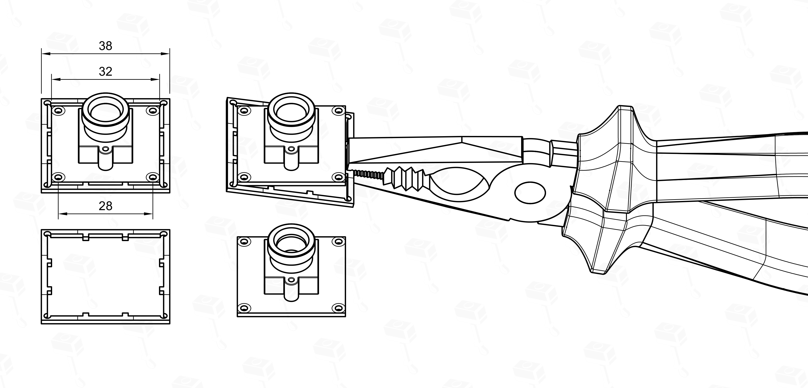

### 3.2 Step 2: Heat Inserts Preparation
> Self-Tapping Version: If you chose this version, you can skip this step.

Melt the **M4 inserts** into the holes of the camera arms and heads using a soldering iron as shown in the picture below.

### 3.3 Step 3: Camera Installation & Closing
**1. Head & Leg Assembly**  
Connect the camera head and leg together using two **M4 screws**. Afterward, pull the USB cable through the internal channel of the body and connect it to the camera's 4-pin connector.

**2. Mounting**  
Secure the camera PCB using two **M2 screws**. 

> **Note:** These holes are self-tapping. Using only two screws is recommended and intentional.

**3. Lens Hood & Closing**  
Twist-lock the lens hood into the camera lid (clockwise), then snap the lid onto the head.
> **Tip:** Choose between the two lens hood designs provided in the print profile.

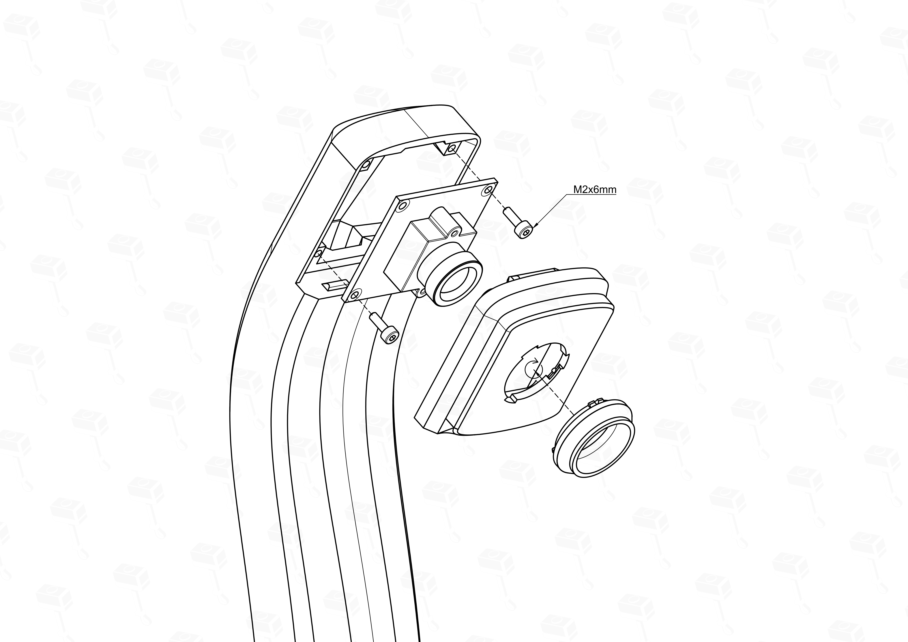

**Final Result of Phase 1**  
After completing these steps, you should have three fully assembled camera arms ready for mounting.

[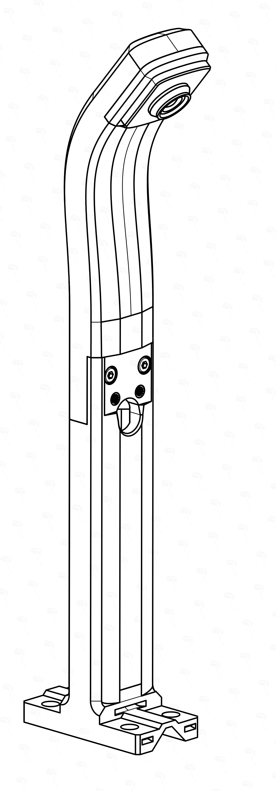](images/03_general/05_result_phase1.png)

---

## 4. Build Options: Choose Your Path

Now that your camera arms are prepared, choose the build guide that fits your setup.

### 4.1 Option 1: Winmau Plasma Light Ring

> **Pro Tip:** You have the option to route the Winmau Plasma's power cable through the internal channels of the IT2 system for an even cleaner look. This requires some extra steps- refer to [Section 6.3: Hiding Winmau Plasma Power Cable](#63-hiding-winmau-plasma-power-cable) for details.

**Step 1: Removing Original Legs**  
Remove the three original mounting legs from your Winmau Plasma light ring. These will be replaced by the IT2 camera arms.

**Step 2: Mounting the IT2 Arms**  
Attach the three [prepared camera arms](#3-general-assembly-camera-arms) to the designated positions on the Winmau Plasma ring. The IT2 arms are designed to fit the Plasma's profile perfectly. Use M4 screws to secure them.  

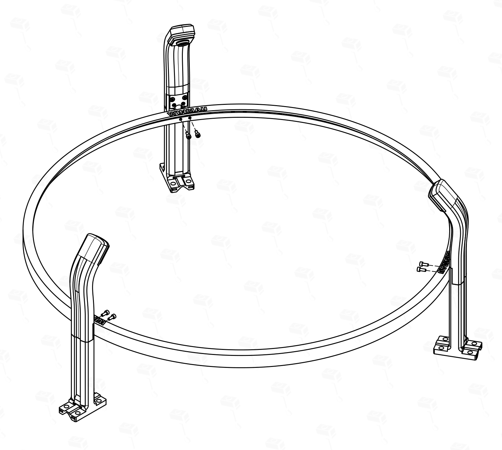

[Back to Table of Contents](#table-of-contents) | **Next Step: [5. Installation to the Wall](#5-final-step-installation--wall-mounting)**

---

### 4.2 Option 2: Setup with IT2 DIY Light Ring

**Step 1: Ring Assembly**  
Assemble the ring by sliding the **dovetail joints** together. Use the **3 mounting segments** and **6 intermediate segments** in the correct sequence for a perfect 120° alignment.

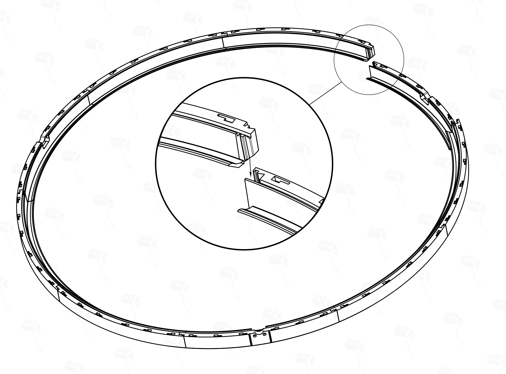

> **Note:** All segments must sit flush against each other. The dovetail joints should slide together with moderate force. If they are too tight, it is likely due to printer tolerances or uncalibrated filament. In this case, carefully sand the dovetail edges until they fit smoothly.

**Step 2: LED Installation**  
Install the **LED strip** as shown in the picture below. Ensure the strip is touching the deepest surface for optimal results.

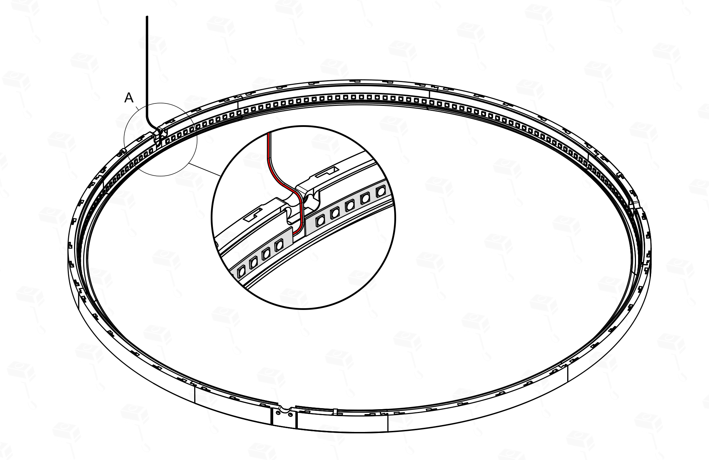

**Step 3: Attaching the Arms**  
Secure the camera arms to the integrated mounting points on the DIY ring using M4 screws. 

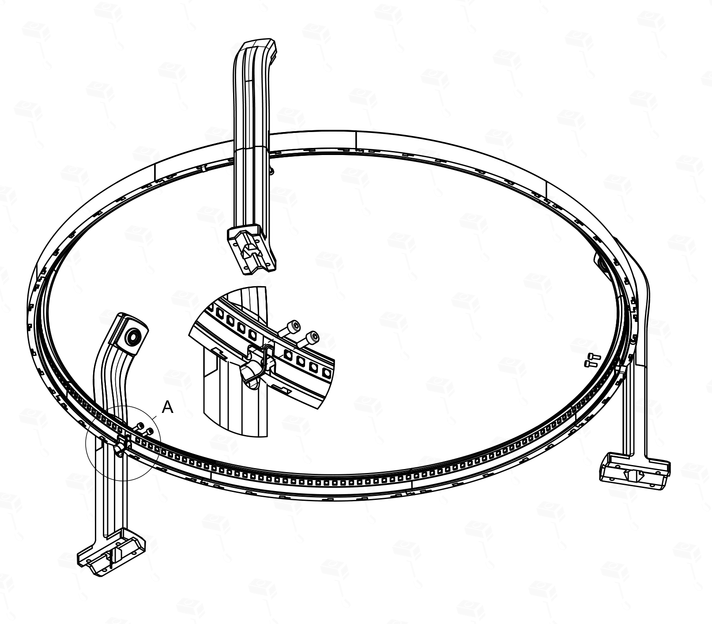

[Back to Table of Contents](#table-of-contents) | **Next Step: [5. Installation to the Wall](#5-final-step-installation--wall-mounting)**

---

### 4.3 Option 3: Target Corona Light Ring

**Step 1: Adapter Preparation**  
Install the **lower part of the IT2 Corona Adapter** onto the three [prepared camera arms](#3-general-assembly-camera-arms) using M4 screws. 

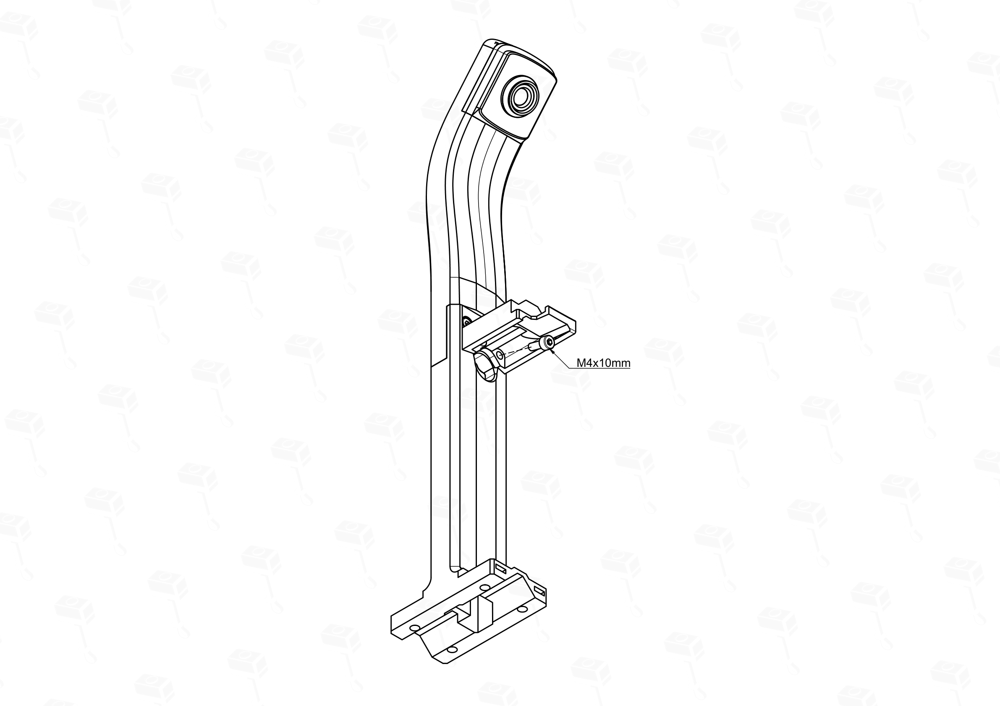

**Step 2: Mounting & Alignment**  
Place the Target Corona ring into the recesses of the installed lower adapter parts. 

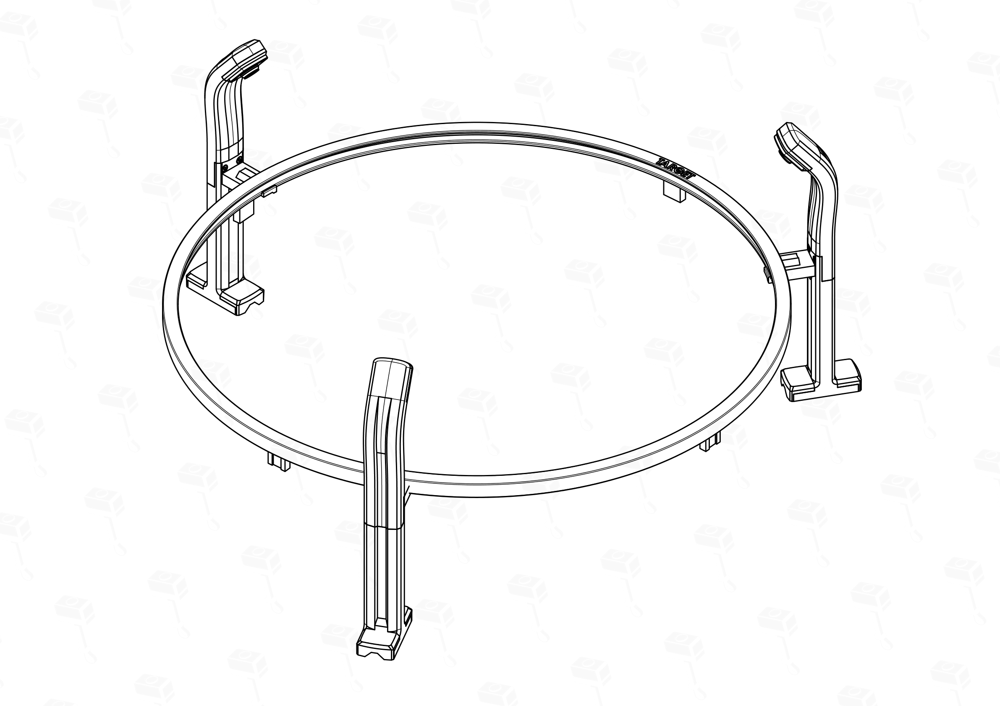

Then, hook the **upper part of the adapter** into the ring and snap it into place. 

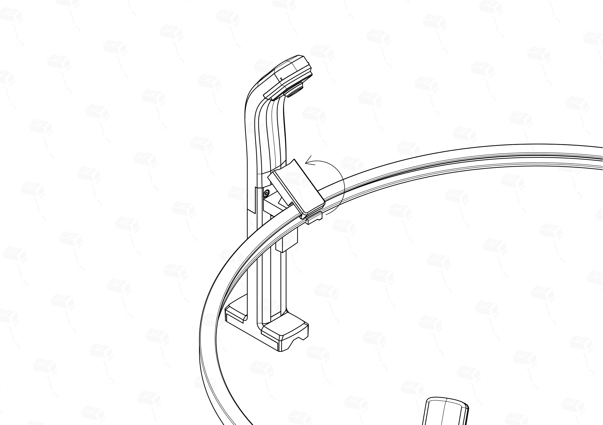

> **Tip:** Try to position the adapters at an approximate **120-degree offset** while snapping them on. This will minimize the amount of fine-tuning needed afterward.

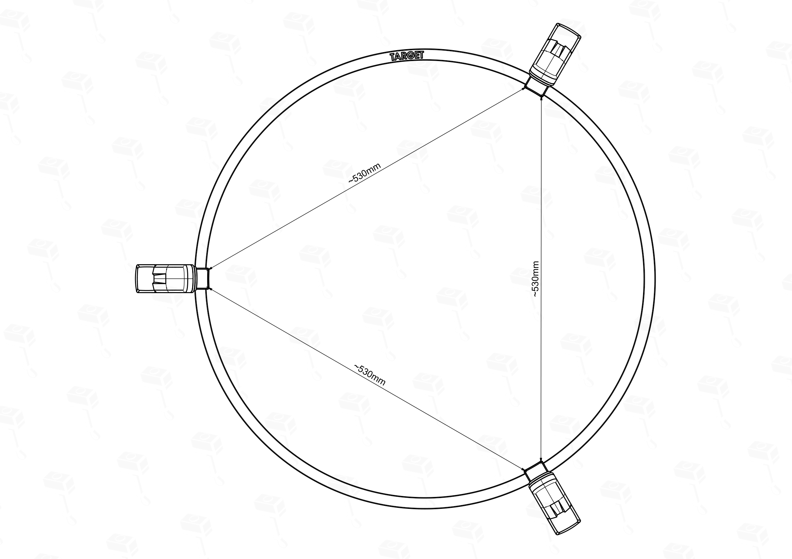

> **Pro Tip:** You have the option to route the Target Corona's power cable through the internal channels of the IT2 system for an even cleaner look. This requires some extra steps- refer to [Section 6.4: Hiding Target Corona Power Cable](#64-hiding-target-corona-power-cable) for details.

[Back to Table of Contents](#table-of-contents) | **Next Step: [5. Installation to the Wall](#5-final-step-installation--wall-mounting)**

---

### 4.4 Option 4: IT2 DIY Low Ceiling Light Ring

> This version was specifically developed for rooms with low ceiling heights. It requires a minimum ceiling height of **2.00m**.

**Assembly Instructions**  
The assembly logic for this version is identical to the standard DIY ring. Please follow the detailed **[Step-by-Step Instructions in Section 4.2](#42-option-2-it2-diy-light-ring)**.

> 💡 **Tip:** Unlike the standard ring, the Low Ceiling version consists of **6 different types of segments**. Before joining the dovetail joints, lay out all pieces on the floor in the correct sequence to prevent assembly errors. Once the dovetails are connected, they can be very difficult to pull apart without damaging the parts.

**Final Result**  
Once assembled, your Low Ceiling Light Ring should look like this:

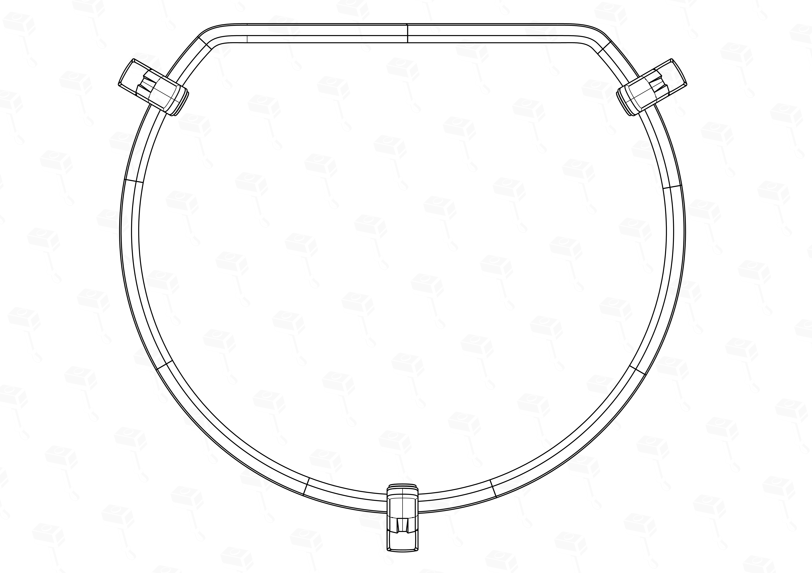

[Back to Table of Contents](#table-of-contents) | **Next Step: [5. Installation to the Wall](#5-final-step-installation--wall-mounting)**

---

## 5. Final Step: Installation & Wall Mounting

The IT2 system offers two main installation paths depending on your requirements for aesthetics, ease of installation, and wall preservation.

### Option A: Direct Mounting
In this configuration, the IT2 system mounts directly to the wall. This requires drilling **6 holes** for the arms and **2 additional holes** for your dartboard mount (if not already installed).
*   **Pros:** Fewer parts to assemble; minimal footprint; the system sits flush against the wall.
*   **Cons:** Requires more drilling points; leg holes must be located manually using measurements, circle drawings, or a drill template.

### Option B: IT2 Baseplate
The **[IT2 Baseplate](https://makerworld.com/en/@HipsThor/)** is an optional unit designed to simplify the installation process and add extra functionality.

*   **Advantages:**
    *   **Ease of Installation:** Center the plate on the bullseye and install it leveled; the complete setup then mounts to the plate using only three wall screws.
    *   **Wall Preservation:** Requires only **3 holes** to be drilled in the wall.
    *   **Sound Insulation:** Features an integrated, optional sound insulation system.
    *   **Stand Compatibility:** Can be installed on a dartboard stand by default (e.g., Winmau Xtreme Dartboard Stand 2).
*   **Trade-offs:**
    *   **Wall Offset:** The baseplate adds approximately **30mm of depth**. You should adjust your oche (throw line) distance by 30mm to maintain official dimensions.

---

### 5.1 Mounting Instructions: Direct Wall Mounting (Option A)
*(Detailed step-by-step instructions for direct wall mounting will follow here)*

### 5.2 Mounting Instructions: Baseplate Mounting (Option B)
*(Detailed step-by-step instructions for mounting via the IT2 Baseplate will follow here)*

[Back to Table of Contents](#table-of-contents)

---

## 6. Pro Tips & Troubleshooting

To ensure the best possible experience with your IT2 system, follow these tips and best practices.

### 6.1 Assembly Best Practices
When tightening screws, ensure they are only **"finger-tight."**
*   Avoid over-tightening, as it can stress the heat inserts.
*   **Self-Tapping Version:** Be especially careful when using the self-tapping version, as the plastic threads can easily be stripped (which is **irreversible**) if too much force is applied.

### 6.3 Hiding Winmau Plasma Power Cable
**Step 1:** ...
**Step 2:** ...
*(Instructions coming soon)*
### 6.4 Hiding Target Corona Power Cable
**Step 1:** ...
**Step 2:** ...
*(Instructions coming soon)*

[Back to Table of Contents](#table-of-contents)

---

## 7. Recommended Electronics

| Part Name    | Type                                   | Link                                                     | Comment                                        |
| ------------ | -------------------------------------- | -------------------------------------------------------- | ---------------------------------------------- |
| Cameras      | HBV OV2710                             | [Aliexpress](https://s.click.aliexpress.com/e/_c4bziy33) | Best Price to Performance Cameras.             |
| LED Strip    | Auxmer 12V 9.6W LED Strip              | [Aliexpress](https://s.click.aliexpress.com/e/_c3z7FC4l) | Personal favorite. Truest to life colors.      |
| PC           | Dell Wyse 5070 >=4GB RAM >= 16 Storage | Aliexpress                                               | Personal favorite. Good Price for performance. |
| Touch Screen | Anmite 16" Touchscreen                 | Aliexpress                                               | Personal favorite. Good Price for performance. |

---

## 8. FAQ

### Q: Which material should I use for 3D printing?
**A:** If your setup is located indoors away from direct sunlight and temperatures stay below **40°C**, standard **PLA** is perfectly sufficient. For environments with higher temperatures or direct sun exposure, **PETG** or **ASA** is recommended, though these can be more challenging to print depending on your printer.

### Q: Which cameras should I choose?
**A:** The clear price-to-performance winner is the **HBV OV2710**. Investing in more expensive, higher-resolution cameras provides no benefit as Autodarts is resolution-limited. While the **OV9732** is a cheaper alternative, it requires significantly better lighting; therefore, I exclusively recommend the OV2710 for its superior handling of various lighting conditions.

### Q: Which LED strip should I get?
**A:** Avoid USB light strips. The community standard is **6000K COB LEDs** (12V or 24V). My personal recommendation is the **Auxmer 120 LEDs/m (9.6W, CRI90)**; in my tests, it outperformed even the Winmau Plasma. If you are on a budget, any 6000K strip with approximately 10W per meter will work. Just ensure it is bright enough.

### Q: Should I use a Raspberry Pi or a Mini PC?
**A:** Unless you already own a Raspberry Pi, I recommend getting a refurbished Mini PC. They are often cheaper (starting at 50€) and offer better performance and touchscreen support. My personal favorite is the **Dell Wyse 5070** (4GB RAM, 16GB storage), which is widely available refurbished and perfectly handles the Autodarts software.

---

## 9. Licensing & Community Support

### Commercial License
*   **For-Profit Sales:** Selling this design for profit requires an active commercial license, available via my [Makerworld Profile](https://makerworld.com/en/@HipsThor/). Sales are only permitted while the subscription is active.

### Exceptions (Non-Commercial)
*   **Personal & Social:** Sharing with friends, family, or your local dart club (at material cost only) is encouraged and does not require a license. I only ask for feedback or a small donation if you like the project.
*   **Community Assistance:** Printing for community members who don't own a printer (at material cost + a small handling fee) is allowed but **MUST** be handled transparently and discussed with me (**IteraThor**) on Discord first.

---

## 10. Support the Project
*   **Feedback:** Join the Discord or leave a comment on Makerworld.
*   **Donations:** Support the development here: [Buy Me a Coffee](https://www.buymeacoffee.com/IteraThor)

---
ST** be handled transparently and discussed with me (**IteraThor**) on Discord first.

---

## 10. Support the Project
*   **Feedback:** Join the Discord or leave a comment on Makerworld.
*   **Donations:** Support the development here: [Buy Me a Coffee](https://www.buymeacoffee.com/IteraThor)

---
