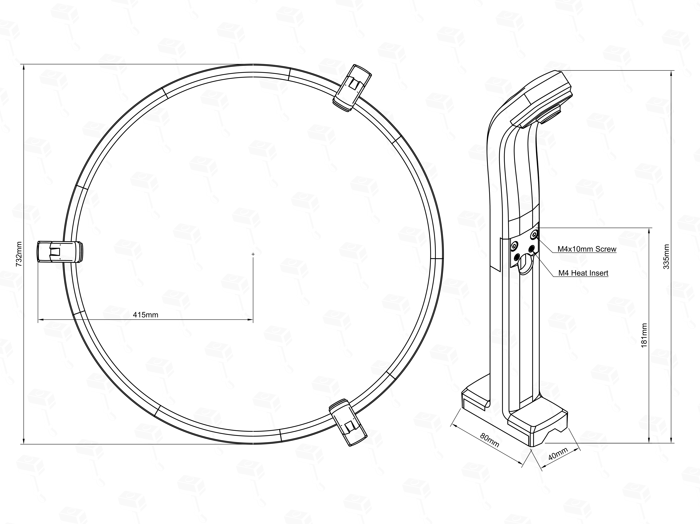
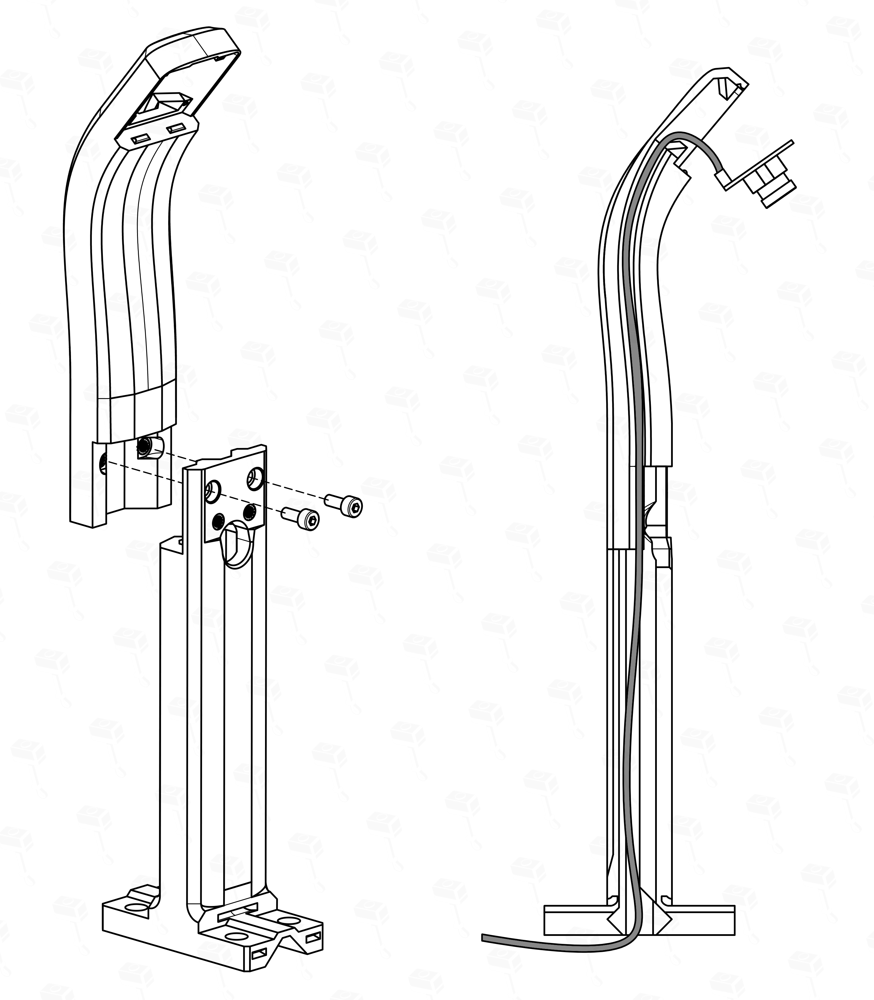

# IT2 - Autodarts Scoring System Manual

**Last Updated:** Wednesday, May 27, 2026  
**Version:** 1.0 (BETA)

Welcome to the official manual for the IT2 Autodarts Scoring System. This guide will walk you through the assembly process.

---
## Table of Contents
1. [General Overview](#1-general-overview)
2. [What You'll Need](#2-what-youll-need)
    * [2.1 Core Hardware (Required)](#21-core-hardware-required)
    * [2.2 Required Tools](#22-required-tools)
3. [General Assembly: Camera Arms](#3-general-assembly-camera-arms)
    * [3.1 Step 1: Camera Preparation & Resizing](#31-step-1-camera-preparation--resizing)
    * [3.2 Step 2: Heat Inserts Preparation](#32-step-2-heat-inserts-preparation)
    * [3.3 Step 3: Camera Installation & Closing](#33-step-3-camera-installation--closing)
4. [Build Options: Choose Your Path](#4-build-options-choose-your-path)
    * [4.1 Option 1: Winmau Plasma Light Ring](#41-option-1-winmau-plasma-light-ring)
    * [4.2 Option 2: IT2 DIY Light Ring](#42-option-2-it2-diy-light-ring)
    * [4.3 Option 3: Target Corona Light Ring](#43-option-3-target-corona-light-ring)
    * [4.4 Option 4: IT2 DIY Low Ceiling Light Ring](#44-option-4-it2-diy-low-ceiling-light-ring)
5. [Final Step: Installation & Wall Mounting](#5-final-step-installation--wall-mounting)
6. [Pro Tips & Troubleshooting](#6-pro-tips--troubleshooting)
    * [6.1 Assembly Best Practices](#61-assembly-best-practices)
    * [6.2 Alignment & Performance](#62-alignment--performance)
    * [6.3 Hiding Winmau Plasma Power Cable](#63-hiding-winmau-plasma-power-cable)
7. [Recommended Electronics](#7-recommended-electronics)
8. [Licensing & Community Support](#8-licensing--community-support)

---

## 1. General Overview

**Project Sirius** was designed with a clear vision: to be the brightest star in the sky. It points the way forward for an Autodarts system that is not only on par with existing solutions but aims to be significantly better in aesthetics, features, modularity, and ease of use.

### Key Features
*   **Sleek & Slim Design** - Slimmest LED Light Ring as of 2026
*   **Hidden Cable Management** - Internal routing for a clean, professional look
*   **Universal Compatibility** - Winmau Plasma, Corona Target - and more in the future
*   **Two Screw Assembly** - Minimalist hardware: M4 for assembly, M2 for cameras

---

## 2. What You'll Need

> **Note:** Many of the product links below are affiliate links. If you use them to make a purchase, I may receive a small commission at no additional cost to you, which helps support the development of this project.

### 2.1 Core Hardware (Required) 

| Part Name          | Type                     | qty  | Link                 | Comment                                                                                                |
| ------------------ | ------------------------ | ---- | -------------------- | ------------------------------------------------------------------------------------------------------ |
| Cylindrical Screws | M4x10mm (ISO4762/DIN912) | 12   | Aliexpress Amazon | Required for most of the assembly                                                                      |
| Cylindrical Screws | M2x6mm (ISO4762/DIN912)  | 6-12 | Aliexpress Amazon | Camera Screws.                                                                                         |
| M4 Heat Inserts*   | 6.3mm OD                 | 12   | Aliexpress Amazon | A heat insert with 6mm OD will also work.  *Only required when printing the heat insert version. |

### 2.2 Required Tools

| Tool                  | Purpose                                                                 |
| --------------------- | ----------------------------------------------------------------------- |
| Hex Key Set           | For M4 and M2 cylindrical screws.                                       |
| Pliers / Side Cutters | Required for resizing the camera frames from 38x38 to 32x32.            |
| Soldering Iron        | Required for melting M4 heat inserts (Heat Insert version only).        |

---

## 3. General Assembly: Camera Arms

Before building your specific version (DIY, Winmau Plasma, or Target Corona), you need to prepare and assemble the three camera arms. This process is identical for all versions.

### 3.1 Step 1: Camera Preparation & Resizing
> Some cameras come with a 38x38mm mounting frame. To fit them, you need to **snap off the outer frame** to resize it to **32x32mm**.

 Carefully break away the perforated edges using pliers.

### 3.2 Step 2: Heat Inserts Preparation
> Self-Tapping Version: If you chose this version, you can skip this step.

Melt the **M4 inserts** into the holes of the camera arms and heads using a soldering iron as shown in the picture below.

### 3.3 Step 3: Camera Installation & Closing
**1. Head & Leg Assembly**  
Connect the camera head and leg together using two **M4 screws**. Afterward, pull the USB cable through the internal channel of the body and connect it to the camera's 4-pin connector.

**2. Mounting**  
Secure the camera PCB using two **M2 screws**. 

> **Note:** These holes are self-tapping. Using only two screws is recommended and intentional.

**3. Lens Hood & Closing**  
Twist-lock the lens hood into the camera lid (clockwise), then snap the lid onto the head.

---

## 4. Build Options: Choose Your Path

Now that your camera arms are prepared, choose the build guide that fits your setup.

### 4.1 Option 1: Winmau Plasma Light Ring

> **Pro Tip:** You have the option to route the Winmau Plasma's power cable through the internal channels of the IT2 system for an even cleaner look. This requires some extra steps refer to [Section 6.3: Hiding Winmau Plasma Power Cable](#63-hiding-winmau-plasma-power-cable) for details.

**Step 1: Mounting the Arms**  
Attach the three prepared camera arms to the designated positions on the Winmau Plasma ring. The IT2 arms are designed to fit the Plasma's profile perfectly. Use M4 screws to secure them.  
*   **Hardware-Locked Alignment:** Once the arms are seated, your 120-degree angles are mathematically perfect. No manual adjustment is required.

**Step 2: Cable Management**  
Route the USB cables through the internal channels of the arms towards the back of the board. This ensures a clean look and protects the cables from stray dart hits.

[Back to Table of Contents](#table-of-contents)

---

### 4.2 Option 2: Setup with IT2 DIY Light Ring

**Step 1: Ring Assembly**  
Connect the 3D-printed segments of the IT2 DIY Light Ring. Ensure the connections are tight to maintain structural integrity.

**Step 2: LED Installation**  
Install the **Auxmer 5000k LED strip** into the recessed channel of the ring. Start from the bottom to ensure the power cable can be routed cleanly.

**Step 3: Attaching the Arms**  
Secure the camera arms to the integrated mounting points on the DIY ring using M4 screws. Like the Plasma version, this setup is **Hardware-Locked** for perfect alignment.

[Back to Table of Contents](#table-of-contents)

---

### 4.3 Option 3: Target Corona Light Ring

**Step 1: Using the Adapters**  
Slide the **IT2 Corona Adapters** onto the Target Corona ring. These adapters provide a stable mounting surface for the camera arms on the thinner Corona frame.

**Step 2: Alignment**  
Attach the camera arms to the adapters using M4 screws. Since the adapters can slide along the ring, you must manually ensure they are positioned at exactly **120 degrees** to each other for optimal scoring accuracy.

[Back to Table of Contents](#table-of-contents)

---

### 4.4 Option 4: IT2 DIY Low Ceiling Light Ring

This version is specifically designed for rooms with limited height. It uses the same core assembly logic as the standard DIY ring but with a modified profile to save space.

**Step 1: Ring Assembly**  
Connect the 3D-printed segments of the IT2 DIY Low Ceiling Light Ring. Ensure the connections are tight to maintain structural integrity.

**Step 2: LED Installation**  
Install the **Auxmer 5000k LED strip** into the recessed channel of the ring. Start from the bottom to ensure the power cable can be routed cleanly.

**Step 3: Attaching the Arms**  
Secure the camera arms to the integrated mounting points on the Low Ceiling ring using M4 screws. This setup is **Hardware-Locked** for perfect alignment.

*(Picture Placeholder)*

[Back to Table of Contents](#table-of-contents)

---

## 5. Final Step: Installation & Wall Mounting

The IT2 system offers two main installation paths depending on your requirements for aesthetics, ease of installation, and wall preservation.

### 5.1 Option A: Direct Mounting
In this configuration, the IT2 system mounts directly to the wall. This requires drilling up to 8 holes (2 for each leg and 2 for your dartboard).
*   **Pros:** Fewer parts to assemble; minimal footprint; the system sits flush against the wall.
*   **Cons:** Requires more drilling points; leg holes must be located manually using measurements, circle drawings, or a drill template.

### 5.2 Option B: IT2 Baseplate
The **IT2 Baseplate** is an optional unit designed to simplify the installation process and add extra functionality.

*   **Advantages:**
    *   **Ease of Installation:** Center the plate on the bullseye and install it leveled; the complete setup then mounts to the plate using only three wall screws.
    *   **Wall Preservation:** Requires only **3 holes** to be drilled in the wall.
    *   **Sound Insulation:** Features an integrated, optional sound insulation system.
    *   **Stand Compatibility:** Can be installed on a dartboard stand by default (e.g., Winmau Xtreme Dartboard Stand 2).
*   **Trade-offs:**
    *   **Wall Offset:** The baseplate adds approximately **30mm of depth**. You **MUST** adjust your oche (throw line) distance by 30mm to maintain official dimensions.

[Back to Table of Contents](#table-of-contents)

---

## 6. Pro Tips & Troubleshooting

To ensure the best possible experience with your IT2 system, follow these professional tips and best practices.

### 6.1 Assembly Best Practices
When securing the cameras with M2 screws and the frame with M4 screws, tighten them until **"finger-tight."** 
*   Avoid over-tightening, as it can stress the 3D-printed threads or slightly bend the camera PCB, which might affect focus.

### 6.2 Alignment & Performance
#### 120° Alignment
Correct alignment is crucial for scoring accuracy. Depending on your version, this is handled differently:

*   **Winmau Plasma & DIY Ring:** These setups feature a **"Hardware-Locked"** alignment. As long as the arms are correctly seated, your 120-degree angles are mathematically perfect—no manual alignment tools required.
*   **Target Corona:** Since the adapters allow the arms to slide freely along the ring, you must take care to align them manually at exactly **120 degrees** to each other for optimal scoring accuracy.

### 6.3 Hiding Winmau Plasma Power Cable
**Step 1:** ...
**Step 2:** ...

[Back to Table of Contents](#table-of-contents)

---

## 7. Recommended Electronics

| Part Name    | Type                                   | Link       | Comment                                        |
| ------------ | -------------------------------------- | ---------- | ---------------------------------------------- |
| Cameras      | HBV OV2710                             | Aliexpress | Best Price to Performance Cameras.             |
| LED Strip    | Auxmer 5000k 12V 9.6W                  | Aliexpress | Personal favorite. Truest to life colors.      |
| PC           | Dell Wyse 5070 >=4GB RAM >= 16 Storage | Aliexpress | Personal favorite. Good Price for performance. |
| Touch Screen | Anmite 16" Touchscreen                 | Aliexpress | Personal favorite. Good Price for performance. |

---

## 8. Licensing & Community Support

### Commercial License
*   **For-Profit Sales:** Selling this design for profit requires an active commercial license, available via my [Makerworld Profile](https://makerworld.com/en/@HipsThor/). Sales are only permitted while the subscription is active.

### Exceptions (Non-Commercial)
*   **Personal & Social:** Sharing with friends, family, or your local dart club (at material cost only) is encouraged and does not require a license. I only ask for feedback or a small donation if you like the project.
*   **Community Assistance:** Printing for community members who don't own a printer (at material cost + a small handling fee) is allowed but **MUST** be handled transparently and discussed with me (**IteraThor**) on Discord first.

### Support the Project
*   **Feedback:** Join the Discord or leave a comment on Makerworld.
*   **Donations:** Support the development here: [Buy Me a Coffee](https://www.buymeacoffee.com/IteraThor)

---
Commercial)
*   **Personal & Social:** Sharing with friends, family, or your local dart club (at material cost only) is encouraged and does not require a license. I only ask for feedback or a small donation if you like the project.
*   **Community Assistance:** Printing for community members who don't own a printer (at material cost + a small handling fee) is allowed but **MUST** be handled transparently and discussed with me (**IteraThor**) on Discord first.

### Support the Project
*   **Feedback:** Join the Discord or leave a comment on Makerworld.
*   **Donations:** Support the development here: [Buy Me a Coffee](https://www.buymeacoffee.com/IteraThor)

---
